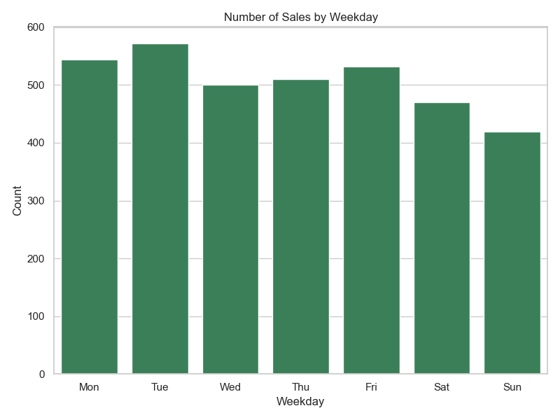
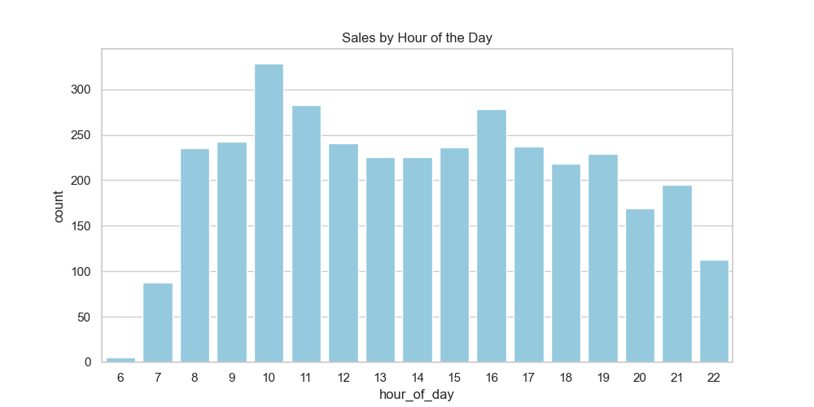
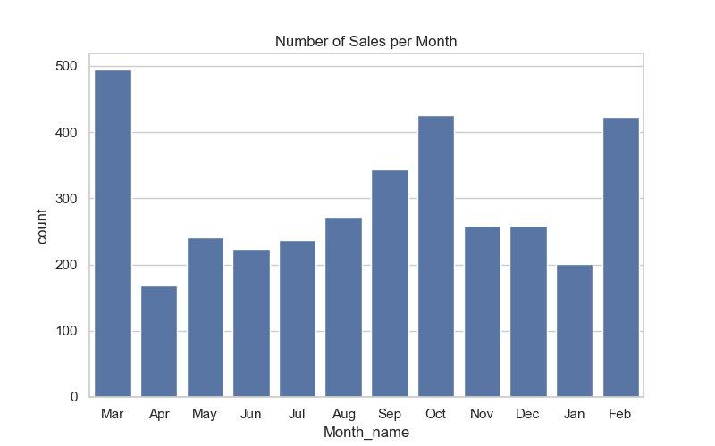

# ☕ Coffee Sales Data Analysis

## 📌 Project Overview
This project explores **Coffee Sales Data** using **Python, Pandas, Matplotlib, and Seaborn**.  
The goal is to identify customer preferences, peak times for purchases, and spending patterns through **exploratory data analysis (EDA)** and visualizations.

## 📂 Dataset
- **File**: `coffee_sales.csv`  
- **Description**: The dataset contains coffee sales records with details such as:  
  - `coffee_name` → Type of coffee sold (Espresso, Latte, Cappuccino, etc.)  
  - `hour_of_day` → Hour when the sale was made  
  - `Time_of_Day` → Morning, Afternoon, Evening, etc.  
  - `Weekday` and `Month_name` → For analyzing sales patterns across days and months  
  - `cash_type` → Payment method (Cash / Card / Digital)  
  - `money` → Amount spent on the transaction  

File Structure

DATA-TRAIN/
│── coffee_sales.csv # Dataset
│── task_notebook.ipynb # Jupyter Notebook with all code & analysis
│── figures/ # Folder containing saved graphs
│ ├── coffee_preferences.png
│ ├── sales_by_weekday.png
│ ├── sales_by_hour.png
│ ├── sales_by_month.png
│ ├── time_of_day_boxplot.png
│ ├── money_distribution.png
│ ├── cash_type_bar.png
│ ├── weekday_violin.png
│── README.md # Project documentation (this file)

## 📊 Visualizations & Insights

### 1. Coffee Preferences by Type
  
- **Espresso and Latte** are the most purchased drinks.  
- Specialty coffees like **Mocha and Cappuccino** are moderately popular.  
- Premium options (e.g., Flat White, Macchiato) are niche.  

---

### 2. Sales by Weekday
  
- Weekdays (especially **Wednesday & Thursday**) have higher sales.  
- Weekends see slightly fewer transactions, possibly due to home consumption.  

---

### 3. Sales by Hour of the Day
  
- Peak sales occur in the **morning hours (8 AM – 11 AM)**.  
- Smaller spikes around **afternoon coffee breaks**.  
- Evenings are less active.  

---

### 4. Sales by Month
  
- Sales fluctuate across months.  
- Certain months (like December) may see a spike due to **festive demand**.  

---

### 5. Boxplot of Sales Amount by Time of Day
  
- Customers spend **more in the mornings** compared to other times.  
- Evening purchases show smaller, consistent spend.  

---

### 6. Distribution of Money Spent
  
- Most transactions are **low-to-medium value**.  
- Very high spending events are rare.  

---

### 7. Sales by Payment Type
  
- Majority of payments are **cashless (cards/digital)**.  
- Cash payments are less frequent but still present.  

---

### 8. Spending Patterns by Weekday (Violin Plot)
  
- Spending is more **variable midweek (Wed/Thu)**.  
- Weekends show more **stable but moderate spending**.  

## 🛠️ Tech Stack
- **Language**: Python 🐍  
- **Libraries**: Pandas, NumPy, Matplotlib, Seaborn  
- **Environment**: JupyterLab  

## 🚀 How to Run
1. Clone the repo:
   ```bash
   git clone https://github.com/AVEEJG/coffee-sales-analysis.git
   cd coffee-sales-analysis

2.Install dependencies:
pip install -r requirements.txt

3.Open JupyterLab:
jupyter lab
Run the notebook task_notebook.ipynb

✅ Conclusion

This project demonstrates exploratory data analysis (EDA) on coffee sales.
With proper insights, coffee shops can optimize menu planning, staffing, and promotions based on customer behavior.
